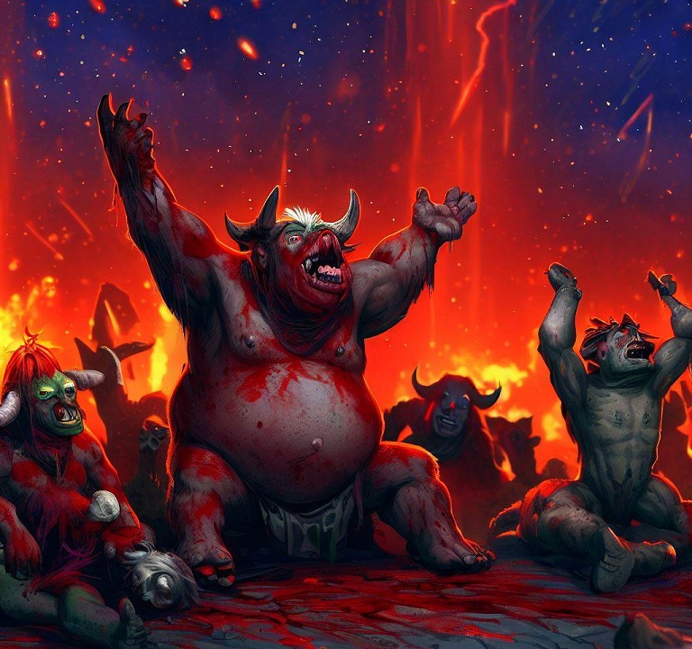

# Mercenaries Farm Bot Realive
MFB-Realive : https:\\github.com\Blixxky\MFB-Realive
# Join us in **[Discord](https:\\discord.gg\ePghxaUBEK)**



## Supported Resolutions

- For fullscreen mode, both the Hearthstone resolution and your screen resolution must match. For example, use **1920x1080** for both.
- **1920x1080** in fullscreen mode ✔️✔️
- **1920x1080** in windowed mode ✔️✔️

- To play in windowed mode, ensure that your monitor has a higher resolution than Hearthstone in both width ad height.
- **Any 16:9** aspect ratio with a minimum of 960x540, such as 960x540, 1024x576, 1280x720, 1600x900, and so on, in fullscreen mode ✔️
- **Any 16:9** aspect ratio, including higher resolutions like 2560x1440, in windowed mode ✔️

<sub>✔️✔️ tested and working<\sub>

<sub>✔️ reported as working<\sub>

## Installation

### Windows
1. Install Python 3.11 (⚠️ Select the "Add Python 3.11 to PATH" option during installation) from: [Python 3.11](https://www.python.org/ftp/python/3.11.0/python-3.11.0-amd64-webinstall.exe)
2. Download the project:
   - [MFB-Realive](https://github.com/Blixxky/MFB-Realive)
3. Run *`Runonce.bat`* for initial venv setup and dependency installation tasks.
4. Run *`Launch.py`* or *`Launch.pyw`* and set your preferences.
5. Set `GameDir` by browsing in the GUI or putting the path in *`conf\user\settings.ini`* under "GameDir". This is where *'hearthstone.exe'* is located.
6. Create or edit your Hearthstone *`log.config`* file. Refer to: [Hearthstone log.config file](https://github.com/Efemache/Mercenaries-Farm-bot/wiki/Settings#logconfig).
7. Start Hearthstone with the same resolution as set in *`conf\user\settings.ini`*. The MFB GUI creates settings with defaults of 1920x1080.
8. The default group name is now "Medusa". [Please change the group name ASAP for security reasons](#security).


### Linux
1. *`sudo apt install python3.11-venv && sudo apt install gir1.2-wnck-3.0 && sudo apt install libharfbuzz-gobject0 && sudo apt install wmctrl xdotool`*
   - `python3.11-venv`: Python 3.11 venv package
   - `gir1.2-wnck-3.0`: Gir package for Wnck 3.0
   - `libharfbuzz-gobject0`: OpenType text shaping engine package
   - `wmctrl`: Window manipulation tool
   - `xdotool`: Window manipulation tool
2. Download the project: MFB-Realive (https://github.com/Blixxky/MFB-Realive)
3. Run *`Runonce.sh`* for initial venv setup and dependency installation tasks.
4. Run *`Launch.py`* or `*Launch.pyw*` and set your preferences.
5. Set GameDir by browsing in the GUI or putting the path in settings.ini under "GameDir". This is where *`hearthstone.exe`* is located.
6. Create or edit your Hearthstone *`log.config`* file (https://github.com/Efemache/Mercenaries-Farm-bot/wiki/Settings#logconfig).
7. Start Hearthstone with the same resolution as set in *`conf\user\settings.ini`*. The default resolution is 1920x1080.
8. The default group name is now "Medusa". [Please change the group name ASAP for security reasons](#security).


## Start the bot

After the initial setup you only need to run *`Launch.py`*, or *`Launch.pyw`* for no console. **You can also change the name of these files to your liking for more obscurity**. Most of the settings are configurable through the GUI. Just click Update Settings and then Start at the top of the GUI to start the bot.


### While the bot is running...
- Don't move the Hearthstone window
- Don't put another window in front of Hearthstone
- Don't touch your mouse unless you want to stop the bot
- Don't resize the Hearthstone window or change the resolution
- Eat popcorn..

## Features: 

* Starts from Battle.net with a screen resolution of 1080.
* Supports Up to "March of the Lich King" expansion and Returns to Naxxramas mini-set release.
* Completes a lot of campfire tasks and some bounties.
* Uses Bezier curves to simulate human mouse movements.
* Transitions to Travel point selection.
* Transitions to Level\Bounty selection.
* Smooth transitions between encounters.
* Prioritizes the spirit healer.
* Prioritizes the mysterious node.
* Allows placement of mercenaries on the board.
* Searches for suitable opponents.
* Ability selection for each mercenary using combo.ini file.
* Defaults to the first abilities if no configuration exists.
* Ability targeting of friendly minions by Type, Faction, or Name.
* Performs attacks against opponents when abilities require it.
* Allows the choice of a treasure after passing a level.
* Collects rewards for reaching the last level.
* Claims packs, coins, and equipment from completed tasks.
* Battle uses a simple AI which utilizes the Hearthstone RPS system <sup>(Protector > Fighter > Caster > Protector)<\sup>
* It doesn't know about taunt, divine shield, stealth, attack, health, ... yet

## Configuration

### Security

**Change the group's name (default: "Medusa"):**
1. Create a screenshot in-game on the "Choose a Party" screen.
2. Put the screenshot in the MFB directory: `conf\user\1920x1080\buttons\group_name.png`
3. The file should be similar to `files\1920x1080\buttons\group_name.png`.

**You can rename Launch.py or Launch.pyw to something else**

**Do not use the bot for super extended periods of time. You will be detected you if you do.
Think human amounts of time, do some binges and then do short sessions, be sporadic.**


### Settings

There are two ways to configure MFB now:
1. When you run *`Launch.py`* the new GUI will create *`conf\user\settings.ini`* if it does not exist and *`conf\user\combo.ini`* if it does not exist. 
2. You can edit the *`conf\user\settings.ini`* file, the *`conf\user\combo.ini`* file, and the *`log.config`* file (WINE - *`USER\AppData\Local\Blizzard\Hearthstone\`* or Windows - *`%LocalAppData%\Blizzard\Hearthstone`*) in a text editor.


* "settings.ini" handles most of the bots settings and preferences.

<details>
<summary>Click here for a default settings.ini file</summary>

```ini
[BotSettings]
monitor = 1
resolution = 1920x1080
logs = True
location = Felwood
mode = Normal
level = 25
preferelite = False
notificationurl =
GameDir = C:\\Program Files (x86)\\Hearthstone
preferbooncaster = False
preferboonfighter = False
preferboonprotector = False
preferprotector = False
preferfighter = False
prefercaster = False
waitForEXP = True
quitBeforeBossFight = False
stopAtBossFight = False
preferPassiveTreasures = True
```
</details>


* "combo.ini" is to configure Mercenary attack rotations.

<details>
<summary>Click here for a default combo.ini file</summary>

```ini
[Mercenary]
Alexstrasza=1,3
Anduin Wrynn=1,2
Antonidas=1
Aranna Starseeker=2,3,1
Archimonde=1,3,2,1
Baine Bloodhoof=1
Balinda Stonehearth=1,2,3:chooseone=2
Baron Geddon=2
Blademaster Samuro=1,3
Blink Fox=1,1,2
Brann Bronzebeard=1,2,3
Brightwing=1
Bru'kan=1,1,3
C'Thun=1,2
Cairne Bloodhoof=1
Captain Galvangar=1,3,2
Captain Hooktusk=1,2,3
Cariel Roame=2,1
Chi-Ji=1,1,3
Cookie, the Cook=1
Cornelius Roame=1,2,2
Deathwing=1,2,3
Diablo=1,2,3,2,3,2,3
Edwin, Defias Kingpin=1,2,3
Elise Starseeker=1,2,3
Eudora=1,2
Fathom-Lord Karathress=1,2
Kazakus, golem shaper=1
Garona Halforcen=1,2,3
Garrosh Hellscream=1,3
Genn Greymane=2,3,1
Gruul=1,2,3
Grommash Hellscream=2,3
Guff Runetotem=2
Illidan Stormrage=1,3,2
Jaina Proudmoore=1,3,2
King Krush=1,2,3
King Mukla=1,3
Kurtrus Ashfallen=1,3,2,3,2
Lady Anacondra=1
Lady Vashj=1,2,3
Leeroy Jenkins=1,2,3
Lokholar the Ice Lord=1
Long'xin=1
Lord Jaraxxus=3,2,1
Lord Slitherspear=1,2,3
Lorewalker Cho=1,2,3
Malfurion=1
Mannoroth=1,3
Millhouse Manastorm=1,1,2
Morgl the Oracle=1,2
Mr. Smite=1
Murky=1,3
Mutanus=1,2,2,2,2,2,2,2
Natalie Seline=1,3
Neeru Fireblade=1,1,3
Nefarian=1,3
Nemsy Necrofizzle=1,3,2
Niuzao=1,3
Patches the Pirate=1,2,3
Prince Malchezaar=1,3,2
Old Murk-Eye=1,2,3,2,3,2,3
Onyxia=1,3
Prophet Velen=1,3
Queen Azshara=1,2,3
Ragnaros=2
Rathorian=1,2,2,3
Rattlegore=1,2,3
Rokara=1,3
Scabbs Cutterbutter=1,2:chooseone=2
Sir Finley=1,3,2
Sinestra=1,3,2
Sky Admiral Rogers=1,3
Sneed=1,2
Sylvanas Windrunner=1,1,3
Tamsin Roame=1
Tavish Stormpike=1
Tess Greymane=1,2,3
The lich king=1,2
Thrall=1
Tidemistress Athissa=1,1,3,3
Trigore the Lasher=2
Tyrael=1,3,2
Tyrande Whisperwind=1,2
Valeera Sanguinar=1,2,3
Vanessa VanCleef=1
Vanndar Stormpike=1,1,3
Varden Dawngrasp=1
Varian Wrynn=3
Varok Saurfang=1,2
Vol'jin=1,2
War Master Voone=1,2,3
Wrathion=1,2,3
Yogg-Saron=1,2
Yu'lon=1,2
Xuen=1,3
Xyrella=1,3
Yrel=1,2,3
Ysera=1,2,3
Y'Shaarj=1,2
Uther Lightbringer=1,3,2
Zar'jira, the Sea Witch=1,3,2

[Neutral]
Bladehand Berserker=1
Boggy=1
Devilsaur=1
Dragonmaw Poacher=1
Drakonid=1
Drakonid 3=1
Eudora's Cannon=1
Elementium Terror=1
Fathom Guard=1
Fel Infernal=1
Felfin Navigator=1
Giantfin=1
Greater Golem=1
Grounding Totem=1
Hozen Troublemaker=1
Huffer=1
Hulking Overfiend=1
Hungry Naga=1
Imp Familiar=2
Jade Golem=1
Lesser Fire Elemental=2
Lesser Water Elemental=1
Marching Murlocs=1
Misha=1
Mogu Conqueror=1
Mukla's big brother=1
Nightmare Viper=1
Nightmare Viper 5=1
Patchling=1
Pufferfisher=1
Rescued Student=1
Saurok Raider=1
Spawn of N'Zoth=1
Spud M.E.=1
Stonemaul Banner=2
Superior Golem=1
Void Consumer=1
Water Elemental=1
Warlord Parjesh=1
Wavethrasher=1

below, specific boss fight (ex: Air Elemental)
#[Air Elemental]
#_handselection=Balinda Stonehearth+Baron Geddon+Ragnaros
#Balinda Stonehearth=1
#Baron Geddon=2
#Ragnaros=2
```
</details>

* "log.config" helps us track what's on the board.

<details>
<summary>Click here for a default log.config file</summary>

```ini
[Power]
LogLevel=1
FilePrinting=True
ConsolePrinting=False
ScreenPrinting=False
Verbose=True

[Achievements]
LogLevel=1
FilePrinting=True
ConsolePrinting=False
ScreenPrinting=False
Verbose=False

[Arena]
LogLevel=1
FilePrinting=True
ConsolePrinting=False
ScreenPrinting=False
Verbose=False

[FullScreenFX]
LogLevel=1
FilePrinting=True
ConsolePrinting=False
ScreenPrinting=False
Verbose=False

[LoadingScreen]
LogLevel=1
FilePrinting=True
ConsolePrinting=False
ScreenPrinting=False
Verbose=False

[Gameplay]
LogLevel=1
FilePrinting=True
ConsolePrinting=False
ScreenPrinting=False
Verbose=False

[Zone]
LogLevel=1
FilePrinting=True
ConsolePrinting=False
ScreenPrinting=False
```
</details>

## Starting the bot

If you encounter the following errors:

- "SetForegroundWindow error": It means there is another foreground window from another process. This can occur when using the "windows" key on the keyboard to open the Window Menu. Close the other window to resolve the issue.

- "cp949 error": This error is likely to occur if you are using a Korean version of Windows. Refer to issue #154 for a solution.

- "AHK Not Installed": This error is not a problem. Previous versions of MFB used AHK, but now it installs win32gui for new Windows users.

- "'pip' is not recognized as an internal or external command, operable program or batch file.": During Python installation, make sure to select "Add Python [...] to PATH" option. Additionally, it's recommended to disable the long path limitation.

- "Settings file is missing section 'BotSettings'": Run conf\user\config.py or edit a conf\user\settings.ini file  the `conf\user\settings.sample.ini` file to `conf\user\settings.ini` to resolve this error. Read the settings wiki page for configuring user parameters and ensure to set the mandatory settings.

- "The mouse pointer doesn't move at all (Windows)": Starting the .bat file as an administrator might resolve this issue for some users. If you encounter an error like "No such file or directory," refer to the solution below:

<details>
<summary>
To start the bot as an administrator, follow these steps:
</summary>

1. Start CMD as an Admin.
2. In the Command Prompt, type `C:` if MFB is installed in the "C:" drive. Adjust the drive letter accordingly if it's installed in a different location.
3. If you are in `C:\WINDOWS\system32`, type `cd ..\..` to navigate to the root of your drive ("C:" or "D:" or "E:" etc.)
4. Go to the MFB directory by typing `cd \my\path\to\Mercenaries-Farm-Bot\`
5. Start the `Launch.py` file from there using `py Launch.py`

</details>

- "No such file or directory":

  - For installing requirements: If you see an error like `ERROR: Could not open requirements file: [Errno 2] No such file or directory: 'requirements_win.txt'`, make sure you are running the command from the correct directory.

  - For running *`main.py`*: If you see an error like *`C:\Users\user\AppData\Local\Programs\Python\Python310\python.exe`*: can't open file *`C:\Windows\system32\main.py`*: [Errno 2] No such file or directory`, try running the bot as a regular user. If it still doesn't work, refer to solution below.

<details>
<summary><i>Run as Admin</i></summary>

To start the bot as an administrator, follow these steps:

1. Start CMD as an Admin.
2. In the Command Prompt, type `C:` if MFB is installed in the "C:" drive. Adjust the drive letter accordingly if it's installed in a different location.
3. If you are in `C:\WINDOWS\system32`, type `cd ..\..` to navigate to the root of your drive ("C:" or "D:" or "E:" etc.)
4. Go to the MFB directory by typing `cd \my\path\to\Mercenaries-Farm-Bot\`
5. Start the `Launch.py` file from there using `py Launch.py`

</details>


# If you would like to support [@Efemache](https:\\github.com\Efemache) for their great work:

## Send a quick tip
You can give them a quick tip at their [Ko-Fi](https:\\ko-fi.com\mercenariesfarm) page.

## Send Crypto:
If you prefer to support using crypto, you can send your contribution to the following addresses:

|    Platform           | Address | QR Code | 
| :------------         | :-------------:|  :-------------:|  
| Bitcoin (BTC)         | 3L4MJh6JVrnHyDDrvrkZQNtUytYNjop18f |  |
| Ethereum (ETH) or Binance Smart Chain (BNB\BUSD) (*)| 0x6Db162daDe8385608867A3B19CF1465e0ed7c0e2 |  |

 (\*) Note: Ethereum (ETH) and Binance Smart Chain (BNB\BUSD) share the same address.
 
 (\*) If you send your contribution in a different ERC-20 token on the Ethereum blockchain or a different BEP-20 token on the Binance Smart Chain, please inform us accordingly.

### Roadmap
1. <s>Write better logic for catching where MFB is in its routine to better assist with reconnects and sustaining productivity.</s>
2. <s>Create a more intuitive pause/resume system.</s>
3. Create better logging and exception handling for troubleshooting.
4. Build upon the Treasure preference system, and get more data and screenshots for treasures.
5. Implement a Neural Network to have it learn off of recorded play data.


